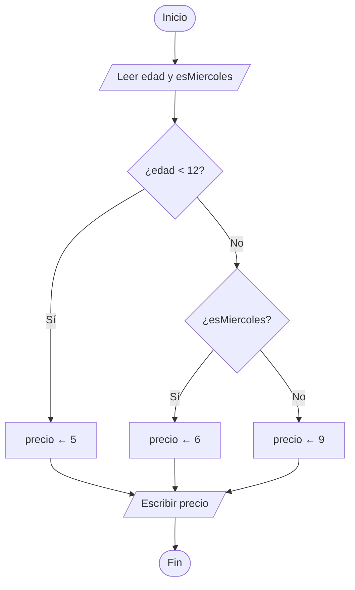

```mermaid
flowchart TD
    inicio(["Inicio"]) --> leer[/"Leer edad y esMiercoles"/]
    leer --> nino{"¿edad &lt; 12?"}
    nino -- Sí --> infantil["precio ← 5"]
    nino -- No --> miercoles{"¿esMiercoles?"}
    miercoles -- Sí --> espectador["precio ← 6"]
    miercoles -- No --> normal["precio ← 9"]
    infantil --> escribir[/"Escribir precio"/]
    espectador --> escribir
    normal --> escribir
    escribir --> fin(["Fin"])
```
